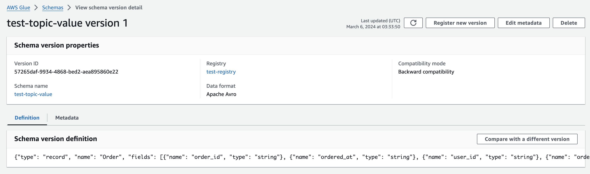

# kafka_example

### env
```bash
cat .env
BOOTSTRAP_SERVERS=b-1.xxx.ap-northeast-2.amazonaws.com:9092,b-4.xxx.ap-northeast-2.amazonaws.com:9092,b-3.xxx.ap-northeast-2.amazonaws.com:9092
TOPIC=test-topic
REGISTRY=test-registry
AUTO_OFFSET_RESET=latest
```

### cmd
```bash
python3.10 -m virtualenv venv
venv
python publish.py
python consume.py
```


### registry ex
